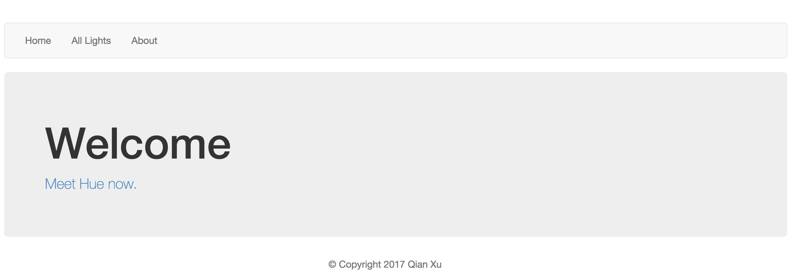

# Nodephilipshue
Nodejs web app for controlling Philips Hue smart light bulb.

[Demo on Youtube](https://www.youtube.com/watch?v=D3yi0Y2WkGA)

## how to run the express server
Open your terminal window, run the following commands:
```
git clone https://github.com/QianXuX/Nodephilipshue/
npm install
node hue-express-new.js
```

## how to use
Open your browser and go to http://localhost:9100/ to start the web app.



## functions
- All lights page shows all connected light bulb devices 
- Browse a particular light bulb by clicking the associated link 
  1. View detailed information of a single light bulb
  2. Change the on/off status and the brightness of the light bulb
  3. Choose different scenes by by clicking the corresponding button
